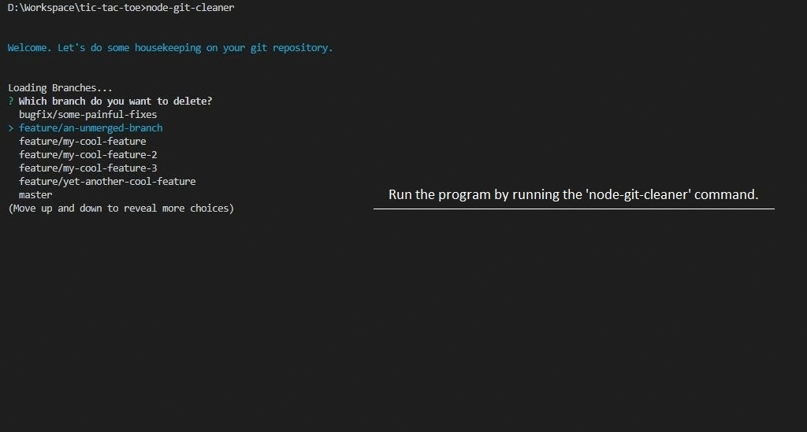

## Node Git Cleaner

### Introduction

Node Git Cleaner is an interactive menu based house keeping tool for your git projects.

If you are a developer who depends on Git bash only without using any GUI client, then after building some great features for your project you must eventually be ending up with lot a of feature branches in your local repository. 

This interactive command line tool helps you remove all the branches without having to type long git delete commands with the branch names. Just select the branch and delete it.

### Usage

- Install using 
    `npm i -g @prashantns9/node-git-cleaner`.
- Run command `node-git-cleaner` in any git repository anywhere in your computer.
- From the interactive menu, select a branch and press enter to delete.